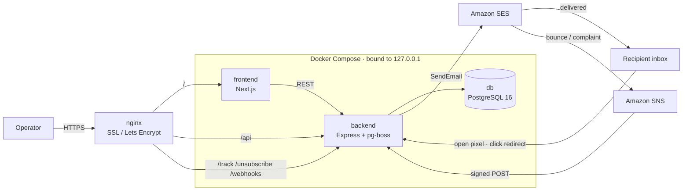

# MailHub

A self-hosted, multi-brand email marketing platform built for **Innovate Solution**.

MailHub sends product updates, new features, bug fixes and promotions to the clients of
several separate brands (Tripgic, Tripmargin, and more later). Each brand keeps its own
contact list, its own sender identity and its own sending reputation — so a problem on one
brand never affects another.

It replaced sending campaigns by hand from WordPress, and it runs on a server we control —
so the cost is one server plus Amazon SES, not a monthly subscription per contact.

**Status:** Phase 1 (MVP) complete and deployed. Live at
**https://mailhub.omarsec.com** (temporary infrastructure — see
[Deployment](#deployment) below).

---

## Architecture



Three containers, all bound to `127.0.0.1` — nothing is reachable from outside except
through nginx. Postgres does double duty: it is the database *and* the job queue
(pg-boss), so there is no Redis to run or monitor.

---

## What it does

| Area | What works |
| --- | --- |
| **Contacts** | Add, edit, delete, CSV import (Papa Parse). Rule: one email = one contact per brand. Every contact has a **type** — `client` / `prospect` / `internal` — plus plan, country and company for filtering. |
| **Templates** | Saved email designs (name, subject, category, HTML). Creating a brand automatically seeds a few ready-made starter designs. The `{{name}}` merge tag is replaced with each recipient's name. |
| **Campaigns** | Create, edit, duplicate, delete. Pick an audience by filter (plan / country / company / contact type) and see the exact "N people will receive this" count before sending. |
| **Scheduling** | Send now, or schedule for later in any timezone. Jobs live inside PostgreSQL via pg-boss, so a server restart never loses a scheduled send. |
| **Exactly-once sending** | The `(campaign, contact)` pair is unique — so retries, crashes, or "Send now" racing a scheduled job **can never email the same person twice**. |
| **Unsubscribe & suppression** | Unsubscribe link plus a one-click `List-Unsubscribe` header (RFC 8058). Suppression is per brand and keyed **by email address** — so deleting a contact, or re-importing the same CSV later, still will not email them. |
| **Bounce & complaint handling** | SES to SNS to `/webhooks/ses` (SNS signature verified). A hard bounce or spam complaint suppresses that address automatically and re-checks auto-pause. |
| **Auto-pause** | A per-brand emergency brake. If bounces or complaints climb, sending stops by itself — and **only a human** can turn it back on. |
| **Tracking** | Open pixel and click redirect. The click route only forwards to links that genuinely appeared in the campaign sent to that recipient. |
| **Analytics** | Dashboard and analytics screens: sent / opened / clicked / bounced, against deliverability targets. |
| **Test send** | Send yourself a real copy **before** sending to everyone (the subject is prefixed `[TEST]`). Suppression and auto-pause still apply, and its unsubscribe link only shows a preview — it changes nothing. |
| **Login** | Email + password, sessions stored in PostgreSQL. Every route is protected by default. |

---

## Tech stack

| Layer | Used |
| --- | --- |
| Language | TypeScript (both frontend and backend) |
| Frontend | Next.js, Tailwind CSS, shadcn/ui, TanStack Query |
| Backend | Express (Node.js) |
| Database | PostgreSQL |
| ORM & migrations | Prisma |
| Job queue | pg-boss (runs inside PostgreSQL — no Redis needed) |
| Input validation | Zod |
| Sending email | Amazon SES (`@aws-sdk/client-sesv2`) |
| Delivery events | SES to SNS to HTTPS webhook |
| Deployment | Docker Compose + nginx + Let's Encrypt |

Deliberately **not used**: Supabase, AWS RDS, Redis. Login/auth is written by hand.
For why each choice was made, see [FINAL-PLAN.md](FINAL-PLAN.md).

---

## How a send works

**At send time**

1. The audience is chosen on the campaign page and the recipient count is confirmed.
2. `POST /campaigns/:id/send` claims the campaign with a single conditional write — so a
   second send can never start on the same campaign.
3. The send loop, per contact: skip suppressed addresses, write the exactly-once recipient
   record, apply merge tags, rewrite every link through `/track/click`, append the
   unsubscribe footer and open pixel, then call SES naming the configuration set (which is
   what routes delivery events back to us).
4. Auto-pause is re-checked every 25 recipients — because bounce news can arrive in the
   middle of a long send.

**Delivery events (bounce / complaint)**

SES publishes hard bounces and complaints to an SNS topic, which POSTs them to
`/webhooks/ses`. The signature is verified, the address is suppressed, and auto-pause is
recalculated.

**Tracking**

`/track/open` records that the email was opened. `/track/click` verifies the destination
really appeared in that campaign's stored HTML before redirecting, so our sending domain
can never be used as an open redirect.

---

## Getting started

### Requirements

- **Node.js 20+** (the Docker image uses Node 24)
- **Docker Desktop** — to run PostgreSQL locally
- An **Amazon SES** access key (only if you want to actually send email)

### Setup

```bash
git clone git@github.com:omarFaruk99/mailhub.git
cd mailhub

# 1. Secrets — copy the example files and fill in real values
cp .env.example .env                  # docker compose reads this
cp backend/.env.example backend/.env  # the backend reads this

# 2. Dependencies
cd backend  && npm install && cd ..
cd frontend && npm install && cd ..

# 3. Database
docker compose up -d db
cd backend && npx prisma migrate deploy && cd ..

# 4. A login account (a fresh database has none)
cd backend
ADMIN_EMAIL=you@example.com ADMIN_PASSWORD='a-strong-password' \
  npx tsx src/scripts/seed-admin.ts
cd ..
```

### Running

```bash
docker compose up -d db            # PostgreSQL
cd backend  && npm run dev         # API at http://localhost:4000
cd frontend && npm run dev         # UI  at http://localhost:3000
```

Then open http://localhost:3000 and log in with the account you created above.

### Useful commands

| Command | From | What it does |
| --- | --- | --- |
| `npm run dev` | `backend/`, `frontend/` | Start with hot reload |
| `npm run build` | `backend/`, `frontend/` | Production build |
| `npm run prisma:studio` | `backend/` | GUI to view and edit database rows |
| `npm run prisma:migrate` | `backend/` | Create and run a new migration |
| `npm run lint` | `frontend/` | ESLint |

> ⚠️ **Never run `npm run build` while `npm run dev` is running** (in `frontend/`).
> Both use the same `.next` folder, so the cache is corrupted and you get a misleading
> "Jest worker … exceeding retry limit" error. If it happens: stop dev, delete
> `frontend/.next`, then start dev again.

---

## Environment variables

Two files, neither committed to git. Every variable is documented in `.env.example` and
`backend/.env.example` — the tables below are only a summary.

### `.env` (repo root — read by Docker Compose)

| Variable | Required? | Notes |
| --- | --- | --- |
| `DB_USER`, `DB_PASSWORD`, `DB_NAME`, `DB_PORT` | Yes | Credentials for the PostgreSQL container. **Do not use `@ : / # ?`** in the password — Compose drops it straight into a connection URL without encoding it. |
| `BACKEND_PORT` | No | Host port for the API. Defaults to `4000`. |
| `NEXT_PUBLIC_API_URL` | Server only | The API address the browser calls. It is baked into the frontend **at build time**, so changing it requires a rebuild. |

### `backend/.env` (read by the backend)

| Variable | Required? | Notes |
| --- | --- | --- |
| `DATABASE_URL` | Yes | Postgres connection string. In Docker this is overridden to use the `db` service name. |
| `AWS_REGION` | Yes | **`us-east-1`.** SES domain verification, DKIM and production access are all **per region**. |
| `AWS_ACCESS_KEY_ID`, `AWS_SECRET_ACCESS_KEY` | Yes | SES credentials. |
| `SES_FROM` | Yes | Verified sender address. Without it the first send errors out. |
| `SES_CONFIGURATION_SET` | Server only | Routes bounce/complaint events to SNS. **Never set it locally** — a name that does not exist in AWS makes SES reject every email. |
| `PUBLIC_URL` | Server only | The backend's address as seen from outside. Every unsubscribe, open and click link points here, and those are opened from someone's inbox days later — so on the server this **must** be the real public URL. Locally it falls back to localhost. |
| `AUTOPAUSE_*` | No | Tune the auto-pause thresholds. Defaults live in `src/email/auto-pause.ts`. |
| `SNS_SKIP_VERIFY` | No | Development only. Disables SNS signature verification. **Never set it on the server** — this webhook suppresses addresses, so anyone who learns the URL could unsubscribe the entire list. |

---

## Folder structure

```
.
├── backend/                    Express API + email worker
│   ├── prisma/
│   │   ├── schema.prisma       Database models
│   │   └── migrations/         SQL migrations already applied
│   └── src/
│       ├── routes/             HTTP endpoints (campaigns, contacts, webhooks, …)
│       ├── email/              Send loop, SES client, auto-pause, audience rules
│       ├── auth/               Session middleware
│       ├── scripts/            One-off jobs (e.g. seed-admin)
│       ├── queue.ts            pg-boss setup for scheduled sends
│       └── index.ts            App entry point
├── frontend/                   Next.js dashboard
│   └── src/
│       ├── app/                Routes and pages
│       ├── components/         Shared UI
│       └── lib/                API client, audience rules, helpers
├── design/                     Static mockups of the UI concept
├── docker-compose.yml          PostgreSQL (dev) or db + backend + frontend (deploy)
└── sample-contacts.csv         Example file for CSV import
```

### Rules that are written in two places

Some logic lives deliberately in both the backend and the frontend, so that the server
emails exactly the people the screen promised. **Change one and you must change the other:**

| Backend | Frontend | Decides |
| --- | --- | --- |
| `matchesText` + `selectAudience` (`src/email/audience.ts`) | `matches` + `audienceOf` (`src/lib/audience.ts`) | Who receives a campaign |
| `defaultTypesForCategory` (`src/email/send-campaign.ts`) | `defaultTypes` (`campaigns/[id]/page.tsx`) | Which contact types are pre-ticked for each category |

---

## Deployment

Docker Compose runs three services — `db`, `backend`, `frontend` — each bound to
`127.0.0.1` only, so none is reachable directly from outside. nginx terminates SSL and
routes:

| Path | Goes to |
| --- | --- |
| `/api/…` | Backend (with the `/api` prefix stripped) |
| `/track/…`, `/unsubscribe`, `/webhooks/…` | Backend at the root path — because these are the exact URLs embedded in emails already sent |
| Everything else | Frontend |

### Shipping a change to the server

```bash
# on the server, from the repo folder
git pull
docker compose up -d --build
```

Database migrations run automatically when the backend container starts.
Secrets are not in git: `.env` and `backend/.env` exist only on the server, so a fresh
clone needs them copied in by hand.

> ⚠️ **The current infrastructure is deliberately temporary.** The app runs on a separate
> AWS EC2 instance on its own subdomain, kept apart from the servers that host other live
> client projects, so a mistake here cannot reach those. Moving it to permanent
> infrastructure is known work.
> **What has to change together during that move:** DNS, SSH config, nginx, the SSL
> certificate, `PUBLIC_URL`, `NEXT_PUBLIC_API_URL` (needs a rebuild) and the SNS webhook
> subscription. Details in [PROGRESS.md](PROGRESS.md).

---

## Rules that must not be broken

These exist because breaking them causes real damage. Full reasoning in [CLAUDE.md](CLAUDE.md).

- **SES runs on a shared, live production account** that other brands also use. There is no
  sandbox to fall back to. Our bounce and complaint rates affect their reputation too.
- **Test only against the SES simulator:** `success@simulator.amazonses.com`,
  `bounce@simulator.amazonses.com`, `complaint@simulator.amazonses.com`. Never use a made-up
  address like `someone@example.com` — on a production account that is a **real hard bounce**.
- **Never set `AWS_REGION` to `ap-southeast-1`.** AWS has disabled this account in that region.
- **Keep bounces under 5% and complaints under 0.1%.** Auto-pause is the emergency brake —
  it sits deliberately looser than these targets, and it never resumes on its own.
- **A contact's `status` cannot be changed**, and a suppressed contact's email address cannot
  be edited — suppression works by address, so renaming would hand that person a fresh
  unblocked identity.
- **Deleting a contact does not delete their suppression record.** That record is what stops
  a later CSV import from emailing someone who unsubscribed.
- **Nothing a client sees contains emoji** — not the subject, body, unsubscribe page, or even
  an input placeholder (placeholders are where the habit starts).
- **Restart both dev servers** after a merge, branch switch or restart. A stale Next.js
  process keeps serving old CSS/JS, which looks exactly like a bug.

---

## Documentation

| File | What it holds |
| --- | --- |
| [PROGRESS.md](PROGRESS.md) | **Read this first.** What is built, what is verified, and what is next. Updated every session. |
| [FINAL-PLAN.md](FINAL-PLAN.md) | The full roadmap — every phase and why. Rarely changes. |
| [CLAUDE.md](CLAUDE.md) | Working rules, architecture rules and deliverability rules. |
| [GLOSSARY.md](GLOSSARY.md) | Technical terms explained for newcomers. |

Answers to SES and deliverability questions are in PROGRESS.md, section "Office AWS SES
account" — that section is the source of truth for this account's real configuration.

---

## Roadmap

| Phase | What | Status |
| --- | --- | --- |
| **1 — MVP** | Sender identity, contacts + CSV import, filtered broadcast, unsubscribe + suppression, bounce/complaint webhook, exactly-once sending, open/click tracking, auto-pause | ✅ Complete |
| **2** | Analytics dashboard ✅ · scheduling + timezones ✅ · login ✅ · multi-team + RBAC · approval workflow · better template editor · saved segments | Partial |
| **3** | Multi-brand, preference centre, automation and drip campaigns, A/B testing | Planned |
| **4** | API auto-sync, list cleaning, monitoring, advanced deliverability | Planned |

Current volume: roughly 700–800 recipients per send, 8,000–10,000 emails a month. At that
level a shared IP is enough; no dedicated IP is needed.

---

## License

Proprietary — © Innovate Solution. Not for outside use.
